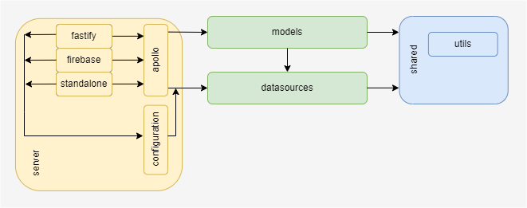

# Application Architecture

The application architecture follows a layered approach. GraphQL schema are implemented in the model
domain (_models_). All business logic should reside here. Access to 3rd-party services will be done
through an abstraction layer - the _datasources_. This closely follows the approach the Apollo team
suggests.

Functionality from the model and datasource domain are allowed to access shared code like utility functions.

Infrastructure code exists in a separate domain (represented as folder in this project template).
Depending on the hosting requirements different server implementation are available
(currently: fastify, firebase and standalone).
Those hosting server implementations are only accessing the apollo server implementation which
stitches everything together. Datasources and configuration are injected in the server context and thus
will be made globally available.



Following these access rules helps to avoid conflicts when working in team with multiple developers.
If multiple teams are working on the same backend a federated GraphQL architecture should be considered.

## Datasources

Datasources are used to establish a low-level communication channel to a 3rd-party service.
This can be a REST service, a database connection or any other resource access.
To access external services often configuration data is needed, like an API endpoint and credentials.
As this information is specific to a datasource it should not be distributed across the application.
Any configuration a datasource needs must be made available as a [zod](https://zod.dev) schema.
The schema will be used to enforce the configuration requirements of the datasource.
The exported schema must be merged with the
[globalEnvironmentSchema.ts](../src/server/configuration/globalEnvironmentSchema.ts)

like this:

```typescript
export const globalEnvironmentSchema = coreEnvironmentSchema.merge(datasourceSpecificEnvSchema);
```

where the datasourceSpecificEnvSchema is the one that was exported in the specific datasource.
This way datasources can contribute to the global application configuration without needing direct
access to infrastructure code.

## Models

The _models_ contain the domain specific GraphQL schema implementation. Subdomains should be identified
and implemented. As datasources will be made available through the server context they can be shared easily
and implementations should follow best practice and exercise separations of concerns.
To support this, the project provides automatic schema merging.

Each subdomain has to provide its own `schema.graphql`. Merging of the schema will be done automatically.
New resolvers must be exported in the models barrel file ([index.ts](../src/models/index.ts))

Typescript models can be generated automatically by running: `yarn generate`
